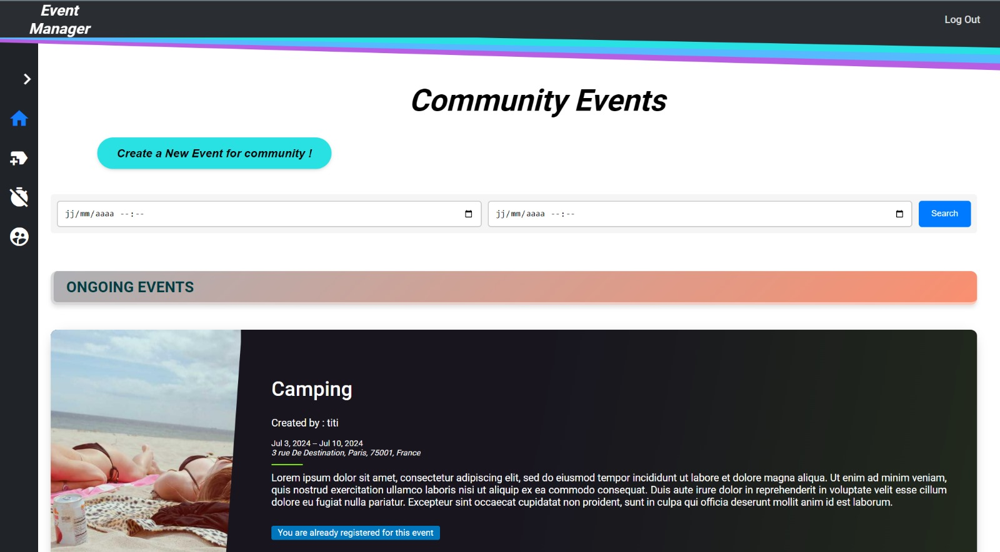

# Event Management Fro
ntend

This repository contains the frontend for an event management we
b application. The application allows users to create, manage, and participate in events. It is built using modern web development technologies to ensure a responsive and user-friendly experience.


## Setup and Installation

1. **Clone the repository**:
   ```sh
   git clone https://github.com/RicardoBOKA/event-management-frontend.git
   ```
2. **Install dependencies**:
   ```sh
   cd event-management-frontend
   npm install
   ```
3. **Start the development server**:
   ```sh
   npm start
   ```
[home.webm](home.webm)
[Screencast from 04-07-2024 13:54:47.webm](Screencast%20from%2004-07-2024%2013%3A54%3A47.webm)


## Features

- **Create and Manage Events**: Users can create events with details such as date, time, location, and description.
- **Registration and Ticketing**: Attendees can register for events and purchase tickets online.
- **Event Listings**: A comprehensive list of upcoming events with search and filter options.
- **Event Details**: Detailed pages for each event, including information about speakers, agenda, and sponsors.
- **User Profiles**: Users can mahnage their profiles and view their registered events.
- **Interactive Maps**: Helps attendees locate event venues easily.
- **Notifications**: Event organizers can send updates to registered attendees.
- **Feedback and Reviews**: Collect attendee feedback to improve future events.
- **Responsive Design**: Accessible on various devices including desktops, tablets, and mobile phones.



## Technologies Used

- **Frontend**: React.js, HTML, CSS, JavaScript
- **Backend**: Node.js, Express.js
- **Database**: MongoDB
- **Hosting**: AWS for image storage
- **Security**: Bcrypt for password hashing
- **API Testing**: Postman

## Contact

For any queries or feedback, please contact [RicardoBOKA](https://github.com/RicardoBOKA).

---

This README provides a comprehensive overview of the project, including its features, technologies used, and instructions for setup and contribution. It ensures that users and contributors have the necessary information to get started with the project. For more details, you can visit the [repository](https://github.com/RicardoBOKA/event-management-frontend).
